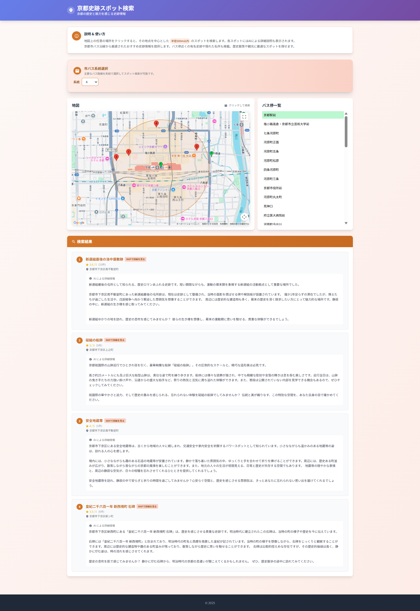
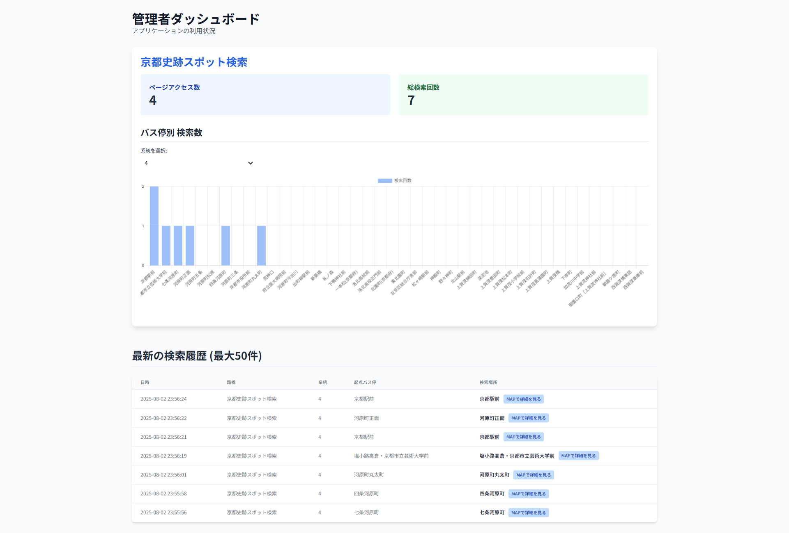

# 京都観光・史跡スポット検索 / 東京カフェスポット検索

## 概要

本プロジェクトは、京都市の史跡・歴史的スポット、または東京都内のカフェスポットを、市バスの路線・バス停情報と連携して検索・閲覧できるWebアプリケーションです。
Google Maps APIを用いて地図上にスポットやバス停を可視化し、さらにGoogle Gemini APIによるAI自動生成の詳細説明を各スポットに付与します。
ユーザーは地域・目的ごとに最適化されたUIで、バス停を起点とした周辺スポット検索や、テーマ（例：カフェ、寺院、庭園など）による絞り込みが可能です。

## 主な機能

- **地域・目的別の動的切り替え**
  - URLパス（例: `/kyoto_bus_route_historical_sites`, `/tokyo_bus_route_cafes`）により、京都市の史跡検索と東京都のカフェ検索を自動で切り替え��
  - サイトタイトル、サブタイトル、地図の初期位置、バス停リスト、検索テーマなどがデータセットごとに自動反映されます。

- **バス停プリセット機能**
  - 市バスの路線系統ごとにバス停情報をプリセットとして管理。
  - サイドメニューからバス停を選択すると、地図がその場所へ移動し、周辺スポットを自動検索。

- **Google Maps API 連携**
  - 地図上に観光スポットや史跡・カフェをマーカー表示。
  - マーカークリックでスポットの詳細情報（AI生成説明含む）を表示。

- **AIによるスポット詳細説明**
  - 各スポットについて、Google Gemini APIを利用して詳細な説明文を自動生成・表示。

- **テーマによる絞り込み検索**
  - データセットごとに設定されたテーマ（例: カフェ、寺院、庭園など）でスポットを絞り込み検索可能。

- **AI生成コンテンツのキャッシュ機能**
  - 一度生成したAIによるスポット説明文をサーバーサイドでキャッシュします。同じ場所が再度検索された場合、APIへの再リクエストを避け、応答速度を向上させます。

## 管理者ダッシュボード

`/admin` にアクセスすることで、アプリケーションの利用状況を可視化するダッシュボードにアクセスできます。

- **ページアクセス数**: データセットごとのページビュー数を表示します。
- **検索統計**: バス路線（系統）ごとに、各バス停がどれだけ検索されたかを棒グラフで表示します。
- **最新検索履歴**: ユーザーが行った最新の検索操作を最大50件まで一覧で確認できます。

## 画面イメージ

<div align="center">
  
  <p>メインの検索画面。地図、バス停一覧、検索結果が表示される。</p>
</div>

<div align="center">
  
  <p>管理ダッシュボ���ド。ページビュー、検索統計グラフ、最新履歴が表示される。</p>
</div>

## セットアップ

1.  **リポジトリのクローン:**
    ```bash
    git clone <repository_url>
    cd <repository_directory>
    ```

2.  **環境変数の設定:**
    Google Maps API と Gemini API のキーを取得し、`.env` ファイルに設定します。
    ```
    MAPS_API_KEY=<your_maps_api_key>
    GEMINI_API_KEY=<your_gemini_api_key>
    ```

3.  **仮想環境の構築:**
    ```bash
    python -m venv venv
    
    # macOS/Linux の場合
    source venv/bin/activate
    
    # Windows の場合
    venv\Scripts\activate.bat
    ```

4.  **依存関係のインストール:**
    ```bash
    pip install -r requirements.txt
    ```

## 実行方法

1.  **Flask アプリケーションの起動:**
    ```bash
    python app.py
    ```

2.  **ブラウザでアクセス:**
    -   **京都市の史跡検索**: `http://localhost:5000/kyoto_bus_route_historical_sites`
    -   **東京都のカフェ検索**: `http://localhost:5000/tokyo_bus_route_cafes`
    -   **(デフォルト)**: `http://localhost:5000/`
    -   **管理者ダッシュボード**: `http://localhost:5000/admin`

## ファイル構成

```
bus_spot_finder/
├── app.py            # Flaskアプリケーション本体
├── config.py         # 設定ファイル（APIキー以外の各種設定）
├── templates/
│   ├── admin.html    # 管理ダッシュボードのHTMLテンプレート
│   └── index.html    # メインページのHTMLテンプレート
├── requirements.txt  # 必要なPythonライブラリ一覧
├── .env              # 環境変数ファイル（APIキーなど）
├── venv/             # Python仮想環境（任意・推奨）
└── README.md         # このドキュメント
```

## 技術スタック

本アプリケーションは、以下の技術を用いて構築されています。

-   **Python 3**: サーバーサイドの主要なプログラミング言語として使用しています。
-   **Flask**: 軽量なWebアプリケーションフレームワーク。APIエンドポイントやルーティング、テンプレートレンダリングなどを担当します。
-   **Google Maps JavaScript API**: 地図表示やスポット検索、バス停の可視化など、インタラクティブな地図機能を実現しています。
-   **Gemini API**: スポット説明文などのAI自動生成に利用しています。
-   **HTML5 / CSS3 / Tailwind CSS**: レスポンシブでモダンなUIを実現するために、テンプレートやスタイリングに活用しています。
-   **JavaScript (ES6+)**: クライアントサイドの動的な処理や地図操作、API通信などを担っています。
-   **Jinja2**: Flaskのテンプレートエンジンとして、HTMLの動的生成に利用しています。
-   **dotenv**: APIキーなどの機密情報を安全に管理するため、環境変数の読み込みに使用しています。
-   **cachetools**: Pythonのキャッシュライブラリ。AI生成結果をメモリ上にキャッシュし、APIコールを削減します。

## 設定ファイル (config.py)

このファイルはアプリケーション全体の動作を制御する各種設定値を一元管理します。主な構成要素は以下の通りです。

-   **defaultDataset**:
    -   アプリ起動時やデータセット未指定時に使用されるデフォルトのデータセット名（例: `"kyoto_bus_route_historical_sites"`）。
    -   ルートやクエリパラメータで明示的にデータセットが指定された場合はそちらが優先されます。
-   **datasets**:
    -   複数の検索目的や都市ごとに設定を分けて管理するための辞書です。各キーがデータセット名となり、値として詳細な設定オブジェクトを持ちます。
    -   各データセットの主な構成は以下の通りです。
        -   **siteInfo**:
            -   サイトのタイトル（`title`）、サブタイトル（`subtitle`）、説明文（`description`）を格納します。
            -   これらは画面上部や説明カードなどに表示されます。
        -   **map**:
            -   地図の初期表示に関する設定です。
            -   `initialLat`/`initialLng`: 地図の初期中心座標（緯度・経度）
            -   `zoom`: 初期ズームレベル
            -   `radius`: 検索半径（メートル単位）
        -   **themes**:
            -   検索テーマやジャンルごとのキーワード設定です。
            -   `defaultTheme`: デフォルトで選択されるテーマ名
            -   `options`: 各テーマごとに`keyword`（検索用キーワード）と`label`（表示用ラベル）を持つ辞書
        -   **busStops**:
            -   各バス路線ごとに、バス停のリストを格納します。
            -   キー: 路線番号や系統名（例: `"205"`, `"RH01"` など）
            -   値: 各バス停の`name`（バス停名）、`lat`（緯度）、`lng`（経度）を持つ辞書のリスト

このように、`config.py`は都市や用途ごとに柔軟に設定を切り替えられるよう設計されています。新たな都市やテーマを追加する場合も、`datasets`に追記するだけで対応可能です。

## ご利用上の注意

本アプリケーションは、AI（人工知能）による自動生成機能を含んでおり、表示されるスポットの説明文や検索結果はAIが生成した内容です。そのため、以下の点にご留意ください。

-   **情報の正確性について**
    -   掲載される説明文やスポット情報は、AIが外部データや入力内容をもとに自動生成したものであり、必ずしも正確・最新・完全であることを保証するものではありません。特に歴史的事実や店舗情報、サービス内容、営業時間等については、実際と異なる場合があります。
-   **位置情報について**
    -   地図上のバス停やスポットの位置情報は、できる限り正確を期していますが、誤差やズレが生じる場合があります。現地を訪れる際は、必ず公式情報や現地の案内等をご確認ください。
-   **責任の範囲**
    -   本アプリケーションの利用により生じたいかなる損害やトラブルについても、開発者は一切の責任を負いかねます。ご利用は自己責任でお願いいたします。
-   **AI生成コンテンツの性質**
    -   AIによる説明文は、一般的な情報や推測を含む場合があります。内容の正確性や適切性についてはご自身でご判断ください。

ご理解のうえ、便利にご活用いただけますと幸いです。

## ライセンス

[MIT](LICENSE)
